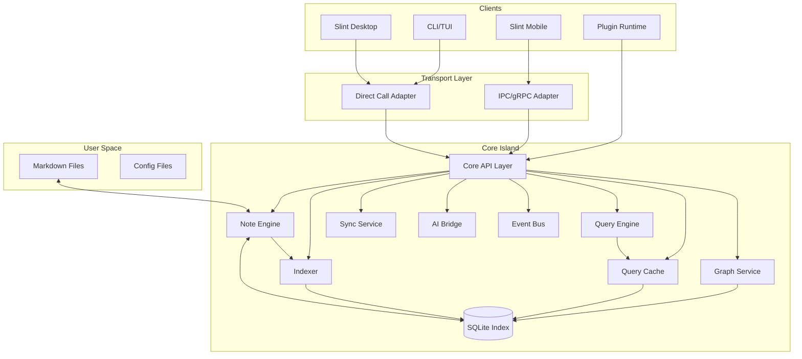

# Tesela Architecture

## 1. Overview

Tesela is a keyboard-first, file-based note-taking system built on the **Island Core** pattern. Notes are Markdown files forming a knowledge mosaic through bidirectional links and typed relationships. The architecture prioritizes data ownership, offline-first operation, and extensibility.

**Key Principles:**
- Files are truth, database is cache
- Core is headless, UIs are thin shells  
- All communication through async trait API
- Plugins sandboxed, no direct file/DB access

## 2. Component Diagram



## 3. Data Flow & Storage Model

### Storage Layers

| Layer | Purpose | Authority |
|-------|---------|-----------|
| Markdown files | Primary storage | Authoritative |
| SQLite index | Query acceleration | Derivative |
| Config TOML | User preferences | User-controlled |

### SQLite Schema (v1)

```sql
-- Core tables
notes (id, path, title, created, modified, checksum)
blocks (id, note_id, content, type, position)
links (source_id, target_id, type, context)
tags (id, name, note_id)
types (id, name, schema_json)

-- FTS5 virtual table
notes_fts (title, content)
```

### Data Flow
1. **Write**: API → Note Engine → Markdown file → Indexer → SQLite → Cache invalidation
2. **Read**: API → Query Engine → Cache (hot path) → SQLite (warm path) → Markdown (fallback)
3. **External edit**: File watcher → Indexer → SQLite update → Cache invalidation → Event broadcast

### Cache Strategy
- LRU cache for frequently accessed notes and queries
- TTL-based expiration for search results
- Invalidation on write operations
- Configurable memory limits

## 4. Core API (Rust traits)

```rust
// Primary service traits
#[async_trait]
pub trait NoteService {
    async fn create(&self, content: &str, metadata: NoteMeta) -> Result<NoteId>;
    async fn update(&self, id: NoteId, content: &str) -> Result<()>;
    async fn delete(&self, id: NoteId) -> Result<()>;
    async fn get(&self, id: NoteId) -> Result<Note>;
    async fn link(&self, from: NoteId, to: NoteId, link_type: LinkType) -> Result<()>;
}

#[async_trait]
pub trait QueryService {
    async fn search(&self, query: &str, filters: SearchFilters) -> Result<Vec<NoteRef>>;
    async fn graph_neighbors(&self, id: NoteId, depth: u8) -> Result<Graph>;
    async fn daily_note(&self, date: NaiveDate) -> Result<Option<Note>>;
}

#[async_trait]
pub trait PluginHost {
    async fn register(&self, manifest: PluginManifest) -> Result<PluginId>;
    async fn call(&self, plugin_id: PluginId, method: &str, args: Value) -> Result<Value>;
    async fn check_rate_limit(&self, plugin_id: PluginId) -> Result<()>;
}

// Plugin rate limiting
pub struct RateLimiter {
    calls_per_minute: u32,
    burst_size: u32,
}

// Event system
pub trait EventSubscriber {
    fn on_note_changed(&self, event: NoteEvent);
    fn on_index_rebuilt(&self, stats: IndexStats);
}
```

## 5. Plugin Architecture

### Security Model

Plugins run in sandboxed environments with capability-based permissions:

```rust
pub struct PluginPermissions {
    read_notes: bool,
    write_notes: bool,
    network_access: bool,
    file_system: FileSystemAccess,
    rate_limits: RateLimiter,
}

pub enum FileSystemAccess {
    None,
    PluginDataOnly,  // Only plugin's data directory
    ReadOnly(Vec<PathBuf>),  // Specific allowed paths
}
```

### Language Support Progression

#### Phase 1: Lua (v1.0)
- **Target**: Power users, Neovim community
- **Runtime**: `mlua` with custom sandbox
- **API**: Synchronous, event-driven

```lua
-- Example plugin: Auto-tagger
local tesela = require("tesela")

tesela.on_note_saved(function(note)
    local content = note:content()
    
    -- Auto-detect programming languages
    if content:match("```rust") then
        note:add_tag("rust")
    end
    
    -- Extract TODOs
    for todo in content:gmatch("TODO:%s*([^\n]+)") do
        tesela.create_task(todo, note.id)
    end
end)
```

#### Phase 2: JavaScript/TypeScript (v1.5)
- **Target**: Web developers
- **Runtime**: QuickJS or embedded Deno
- **API**: Async-first, Promise-based

```typescript
import { Plugin, Note } from "@tesela/plugin-api";

export default class SmartLinker extends Plugin {
    async onNoteCreated(note: Note) {
        const similar = await this.findSimilarNotes(note);
        
        for (const match of similar) {
            if (match.similarity > 0.8) {
                await note.addLink(match.id, "related");
            }
        }
    }
}
```

#### Phase 3: WebAssembly (v2.0)
- **Target**: Any language, high-performance plugins
- **Runtime**: Wasmtime with WASI
- **API**: Interface types, component model

### Plugin API Surface

```rust
// Core plugin trait
#[async_trait]
pub trait Plugin {
    fn manifest(&self) -> &PluginManifest;
    async fn activate(&mut self, host: PluginHost) -> Result<()>;
    async fn deactivate(&mut self) -> Result<()>;
}

// Available hooks
pub enum PluginHook {
    // Lifecycle
    OnNoteCreated(NoteId),
    OnNoteUpdated(NoteId, ChangeSet),
    OnNoteDeleted(NoteId),
    
    // User actions
    OnSearch(Query),
    OnLinkCreated(LinkId),
    
    // System events  
    OnIndexComplete,
    OnSyncStart,
    
    // UI extension points
    OnEditorAction(Action),
    OnRenderNote(NoteId),
}

// Plugin capabilities
impl PluginApi {
    // Read operations
    async fn get_note(&self, id: NoteId) -> Result<Note>;
    async fn search(&self, query: &str) -> Result<Vec<NoteRef>>;
    async fn get_tags(&self) -> Result<Vec<Tag>>;
    
    // Write operations (permission gated)
    async fn update_note(&self, id: NoteId, content: &str) -> Result<()>;
    async fn add_tag(&self, note: NoteId, tag: &str) -> Result<()>;
    
    // Plugin storage
    async fn get_data(&self, key: &str) -> Result<Option<Value>>;
    async fn set_data(&self, key: &str, value: Value) -> Result<()>;
    
    // UI extensions
    async fn show_notification(&self, msg: &str) -> Result<()>;
    async fn register_command(&self, cmd: Command) -> Result<()>;
}
```

### Example Plugin Use Cases

| Plugin | Language | Permissions | Purpose |
|--------|----------|-------------|---------|
| Auto-tagger | Lua | Read notes | Tag based on content patterns |
| Daily summary | JS/TS | Read notes, Network | Generate AI summaries |
| Citation manager | WASM | Read/write notes, Network | Manage academic references |
| Graph visualizer | JS/TS | Read notes | Custom graph layouts |
| Sync adapter | Rust/WASM | Read/write, Network | Custom sync backends |

### Plugin Distribution

- **Registry**: GitHub-based plugin registry (like Obsidian)
- **Format**: `.tplugin` bundle with manifest + code + assets
- **Installation**: Copy to `~/.tesela/plugins/`
- **Updates**: Semantic versioning with compatibility checks

## 6. Deployment & Sync Options

| Mode | Transport | Use Case |
|------|-----------|----------|
| Embedded | Direct calls | Desktop app, CLI |
| IPC | Unix socket/Named pipe | Mobile, sandboxed environments |
| Network | gRPC + TLS | Remote clients, web UI |
| Sync | WebDAV/S3 + E2E encryption | Multi-device |

**Sync Strategy:**
- Conflict-free replicated data types (CRDT) for real-time collaboration
- Operational transformation for offline edits
- Merkle trees for efficient diff detection

## 7. Open Risks

| Risk | Impact | Mitigation |
|------|--------|------------|
| SQLite lock contention | Performance degradation | WAL mode, read replicas |
| Large file handling | Memory pressure | Streaming parser, chunked indexing |
| Plugin security | Data breach | Capability-based permissions, WASM sandbox |
| Schema evolution | Breaking changes | Versioned migrations, compatibility layer |
| Cross-platform file watching | Missed updates | Polling fallback, checksums |

## 8. Roadmap / Future Enhancements

### Phase 1: Foundation (v0.1-0.3)
- Core library with file operations
- SQLite indexing
- Basic CLI

### Phase 2: Desktop (v0.4-0.6)
- Slint desktop UI
- Plugin system (Lua)
- Local graph visualization

### Phase 3: Intelligence (v0.7-0.9)
- AI integration (local LLM, OpenAI bridge)
- Smart linking suggestions
- Content summarization

### Phase 4: Collaboration (v1.0+)
- Self-hosted sync server
- CRDT-based real-time editing
- Mobile clients
- WASM plugin runtime

### Future Considerations
- **Performance**: Incremental indexing, parallel query execution
- **Graph Database**: Consider embedded graph DB (e.g., `indradb`) for complex relationship queries
- **Federation**: ActivityPub for public notes
- **Export**: Pandoc integration, static site generation
- **Analytics**: Local knowledge graph metrics
- **Plugin Security**: Move from Lua to WASM for better sandboxing
- **Advanced Caching**: Distributed cache for multi-instance deployments